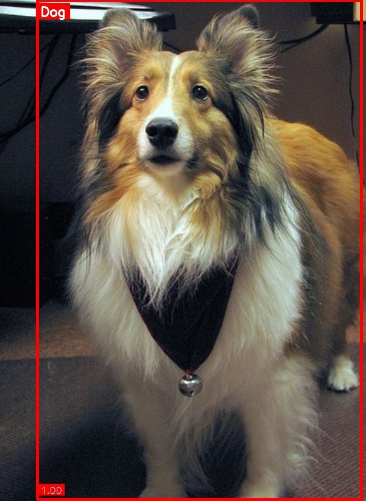

# Video Detection & Classification System

Detects and classifies humans and animals in videos with optional OCR.

## Setup

```bash
pip install -r requirements.txt
```

## Run

```bash
streamlit run app.py
```

## Pipeline

1. **Frame Extraction** - Extract frames from video
2. **Detection** - Faster R-CNN detects objects
3. **Crop Objects** - Extract detected regions
4. **Classification** - ResNet18 classifies human/animal
5. **Draw Boxes** - Visualize results
6. **OCR** (optional) - Extract text from frames
7. **Save Output** - Generate processed video

## Training

Place your dataset in:
- `data/train/human/` - Human images
- `data/train/animal/` - Animal images
- `data/val/human/` - Validation humans
- `data/val/animal/` - Validation animals

For detection training, create `data.yaml`:
```yaml
train: data/train
val: data/val
nc: 2
names: ['human', 'animal']
```

## Models

- Detection: Faster R-CNN with ResNet50-FPN (pretrained on COCO)
- Classification: ResNet18 (pretrained on ImageNet)
- OCR: EasyOCR
## Results
.jpg>)
